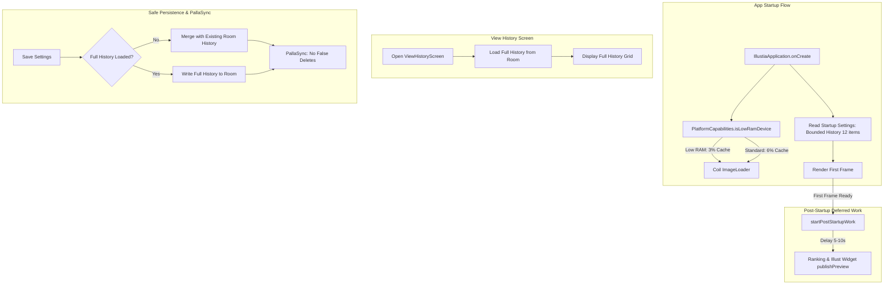

# Requirements

### Overview & Goals
Provide automatic performance optimizations for low-spec and low-RAM Android devices (e.g., RAM <= 3.5GB or Android Go / low-RAM devices) to eliminate startup stutter and excessive memory footprint, while preserving full data consistency and synchronization (PallaSync).

### Scope
- **In Scope:**
  - **Auto Profile (Device Detection):** Implement RAM-based detection (`ActivityManager.isLowRamDevice()` and `MemoryInfo.totalMem <= 3.5GB`) while keeping CPU core count as a low-priority metric.
  - **Coil Image Loader Optimization:** Reduce memory cache size percentage (3% for low RAM vs 6% standard) and defer/conditionally load heavy animated decoders (`AnimatedImageDecoder`, `GifDecoder`).
  - **Startup Widget Preview Deferral:** Delay `publishPreview` (5–10s) in `RankingWidgetProvider` and `IllustWidgetProvider` to prevent startup CPU/Bitmap contention.
  - **View History & Settings Loading Optimization:** Load only recent items (12–16) on startup, lazy-load full history in `ViewHistoryScreen`, and implement safeguards in `SettingsStore` / Room / PallaSync to prevent historical data loss or false deletion sync events.
  - **Version Bump & Release:** Bump version to `5.6.0-beta.1` (`versionCode 81`), and commit & push changes.
- **Out of Scope:**
  - Complete rewrite of Room database schemas.
  - Disabling core illustration browsing functionality.

### User Stories
- **As a user with an entry-level or low-RAM smartphone**, I want Palleria to launch smoothly without lagging or dropping frames, so that I can start browsing artworks immediately.
- **As a user using PallaSync across multiple devices**, I want my browsing history to remain safely synchronized without older history items getting wiped out when launching the app on a low-spec device.
- **As a user viewing the history screen**, I want my full history to be loaded seamlessly on demand when I navigate to the history screen.

### Functional Requirements
1. **Low-Spec Auto Detection:** Automatically identify low-spec / low-RAM devices based primarily on total RAM and system low-RAM flags.
2. **Dynamic Coil Memory Management:** Dynamically allocate 3% max memory cache for low-RAM devices and 6% for standard devices.
3. **Deferred Widget Previews:** Post-startup widget preview generation must not block or compete with initial UI frame rendering.
4. **Lazy History Loading:** App launch loads only recent history items; full history is loaded asynchronously when opening `ViewHistoryScreen`.
5. **Sync & Persistence Safeguards:** Room writes and PallaSync diff calculations must distinguish between unloaded history and user-deleted history to avoid data loss.

# Technical Design

### Current Implementation
- `IllustiaApplication.kt` configures Coil `SingletonImageLoader` with a fixed 6% `maxSizePercent` and unconditionally registers `AnimatedImageDecoder` and `GifDecoder`.
- `IllustiaApplication.startPostStartupWork()` immediately generates widget bitmap previews (`RankingWidgetProvider.publishPreview` and `IllustWidgetProvider.publishPreview`) on the first frame.
- `SettingsStorePreferences.kt` / `SettingsStoreRoom.kt` read all `viewHistory` items (up to 48 `Illust` models with URLs and tags) at startup, which are hydrated into `AppSettings` on the main thread / early startup flow.
- `SettingsStore.write` and `writeRoomSettingsData` replace the entire `view_history` table from `settings.viewHistory`, meaning a truncated list in `AppSettings` would wipe the Room database if not properly guarded.

### Key Decisions
1. **Detection Metric Priority:**
   - Primary: `ActivityManager.isLowRamDevice()` and `MemoryInfo.totalMem <= 3.5GB`.
   - Rationale: Memory constraints are the direct cause of GC churn, startup thrashing, and background app kills on entry-level Android devices; CPU core count is unreliable due to heterogeneous big.LITTLE architectures.
2. **Sync-Safe History Architecture:**
   - Introduce a distinction between "startup preview history" and "full history" in the repository / DAO.
   - Guard `SettingsStore.write` and `PallaSync` event generation so that saving unrelated settings with a partial in-memory history preserves existing history records in Room and does not emit `SYNC_OPERATION_DELETE` events.
3. **Deferred Widget & Decoder Work:**
   - Delay `publishPreview` execution by 5–10 seconds in `startPostStartupWork()`.
   - On low-RAM devices, avoid heavy decoder initialization overhead on startup.

### Proposed Architecture & Data Flow

### Components & File Structure
- `PlatformCapabilities.kt`: Add `isLowRamDevice(context)` and `isLowSpecDevice(context)` methods.
- `IllustiaApplication.kt`: Configure Coil memory cache percentage and decoder setup dynamically; delay widget preview generation in `startPostStartupWork`.
- `SettingsDao.kt`: Add bounded `getViewHistory(limit: Int)` query and keep `getViewHistory(): List<ViewHistoryEntity>`.
- `SettingsStoreRoom.kt` & `SettingsStore.kt`: Ensure persistence operations safely retain Room history records when only partial in-memory history is present.
- `ViewHistoryScreen.kt` & `IllustiaSettingsSecurityModule.kt`: Trigger full history load on navigating to the history screen.
- `RankingWidgetProvider.kt` & `IllustWidgetProvider.kt`: Add checks and throttling for preview publishing.
- `app/build.gradle`: Version update to `5.6.0-beta.1` / `versionCode 81`.

### Risks & Mitigations
- **Risk:** Truncated in-memory `viewHistory` causing PallaSync to sync deletions to other devices.
  - **Mitigation:** Ensure sync event generator (`PallaSyncSettingsEvents.kt`) and `SettingsStore.write` only compute deletions when full history is loaded or explicit remove actions are triggered.
- **Risk:** Stale or missing history on `ViewHistoryScreen`.
  - **Mitigation:** In `ViewHistoryScreen`, trigger an asynchronous query for the complete history upon screen entry if not already populated.

# Testing

### Validation Approach
Verify that low-RAM detection, Coil memory capping, deferred widget creation, history paging, and PallaSync stability work as expected through automated unit tests and build validation.

### Key Scenarios
1. **Low-RAM Device Profile Detection:**
   - Verify `PlatformCapabilities.isLowRamDevice()` correctly flags devices with <= 3.5GB RAM or `isLowRamDevice = true`.
2. **Coil Image Loader Configuration:**
   - Verify memory cache percentage is appropriately set (3% for low RAM, 6% for normal).
3. **Widget Preview Deferral:**
   - Verify that `RankingWidgetProvider.publishPreview` and `IllustWidgetProvider.publishPreview` are executed only after the post-startup delay and do not block the main thread.
4. **View History & Sync Consistency:**
   - Verify that starting the app with bounded history does not wipe older history records in Room DB upon saving settings.
   - Verify that PallaSync does not generate false `SYNC_OPERATION_DELETE` events for unloaded history records.
   - Verify that opening `ViewHistoryScreen` loads all history records.
5. **Release Build & Git State:**
   - Verify `./gradlew.bat :app:testDebugUnitTest` passes.
   - Verify `./gradlew.bat :app:assembleDebug` builds cleanly with version `5.6.0-beta.1` (`versionCode 81`).

### Test Changes
- Update and add unit tests in `SyncedSettingsMergeTest.kt` and `PallaSyncSettingsEventsTest.kt` for bounded/partial history preservation.
- Verify existing `OAuth2RpcTest.kt` and UI tests continue passing.

# Delivery Steps

### ✓ Step 1: Implement Low-Spec Hardware & RAM Profile Detection
Add low-spec and low-RAM device detection logic to `PlatformCapabilities` to categorize device performance profiles without over-relying on CPU core count.

- Add `isLowRamDevice(context: Context)` and `isLowSpecDevice(context: Context)` helper functions in `PlatformCapabilities.kt` using `ActivityManager.isLowRamDevice()` and `MemoryInfo.totalMem` (threshold <= 3.5GB).
- Ensure CPU core count is given low/minimal weight in performance classification.
- Unify memory threshold checks across the app (including Discord RPC and future profile-based feature toggles).

### ✓ Step 2: Optimize Coil Memory Cache and Decoder Initialization
Optimize Coil ImageLoader memory consumption and postpone heavy animated image decoders on low-spec/low-RAM devices.

- In `IllustiaApplication.kt`, adjust `MemoryCache.Builder().maxSizePercent()`: use `0.03` (3%) on low-RAM devices and `0.06` (6%) on standard devices.
- Defer or make conditional the registration of animated decoders (`AnimatedImageDecoder`, `GifDecoder`) so low-spec devices do not incur class loading and decoder heap overhead during initial startup image requests.
- Verify image loading behavior and memory allocation across different device profiles.

### ✓ Step 3: Defer and Throttle Startup Widget Preview Generation
Postpone and gate widget preview bitmap generation so that background bitmap processing does not compete with initial UI rendering.

- In `IllustiaApplication.kt` (`startPostStartupWork`), add a delay (5–10 seconds) before calling `RankingWidgetProvider.publishPreview` and `IllustWidgetProvider.publishPreview`.
- In `RankingWidgetProvider.kt` and `IllustWidgetProvider.kt`, check whether widget preview generation is supported and whether widget previews should be skipped or throttled on low-spec devices.
- Ensure foreground UI frames are completely rendered without startup thread contention from widget rendering.

### ✓ Step 4: Implement Lazy View History Loading with Sync Integrity Safeguards
Optimize startup history loading to only fetch recent items while supporting on-demand paging in `ViewHistoryScreen`, with strict safeguards against destroying PallaSync and Room DB data.

- Update `SettingsDao.kt` to support bounded history queries (`getViewHistory(limit)`) alongside full history retrieval.
- Update startup settings loading to only load a recent subset (e.g., 12–16 items) into in-memory `AppSettings` at launch time.
- In `SettingsStore.kt` and `SettingsStoreRoom.kt`, implement safe partial/full history writes ensuring that writing settings with a truncated in-memory history never clears or deletes older history records in Room DB.
- Ensure `rebaseSyncedCollections` and `buildSettingsSyncEvents` in PallaSync do not emit spurious delete events for unloaded historical items.
- In `ViewHistoryScreen.kt` and `IllustiaViewModel`, implement lazy/on-demand full history loading when the user enters the View History screen.

### ✓ Step 5: Testing, Version Bump (5.6.0-beta.1 / versionCode 81), and Git Commit/Push
Verify unit tests, build the application, update the version info to 5.6.0-beta.1 (versionCode 81), and commit/push changes.

- Run unit tests (`OAuth2RpcTest`, `SyncedSettingsMergeTest`, `PallaSyncSettingsEventsTest`, and new low-RAM / history loading tests) to ensure zero regressions.
- Update `app/build.gradle` to `versionCode 81` and `versionName "5.6.0-beta.1"`.
- Stage all modified files (`git add -A`), create a commit with release details, and push to the remote `main` branch.